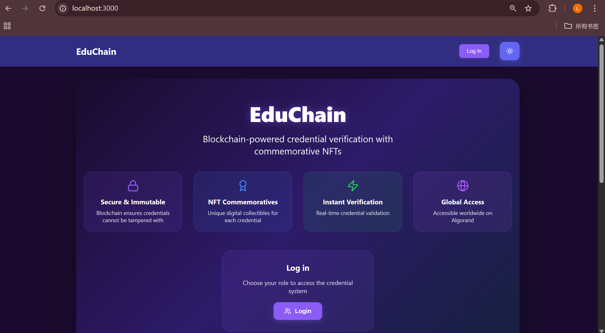
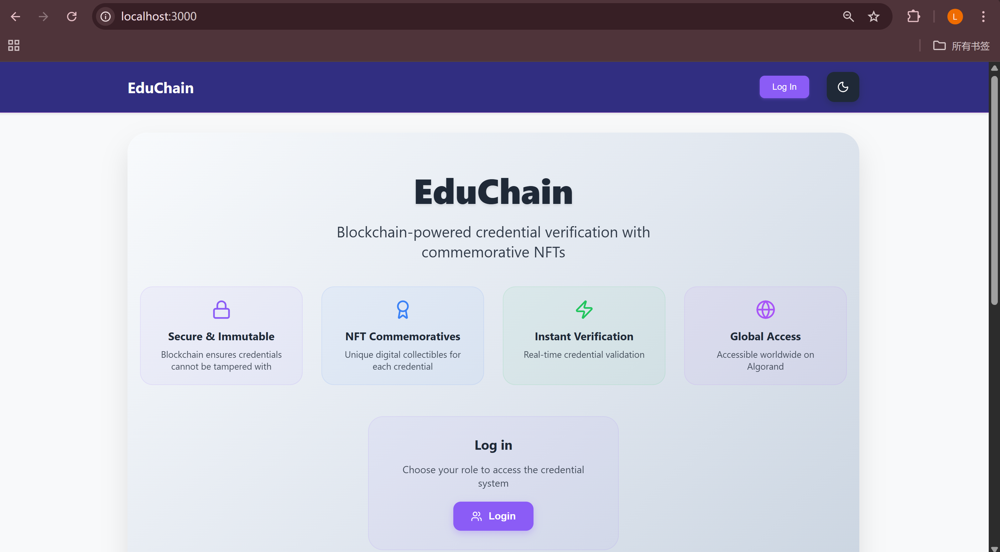
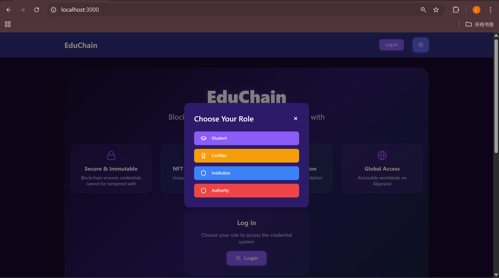
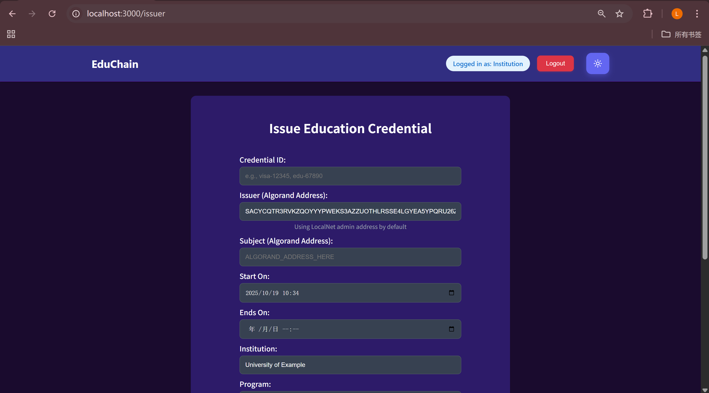
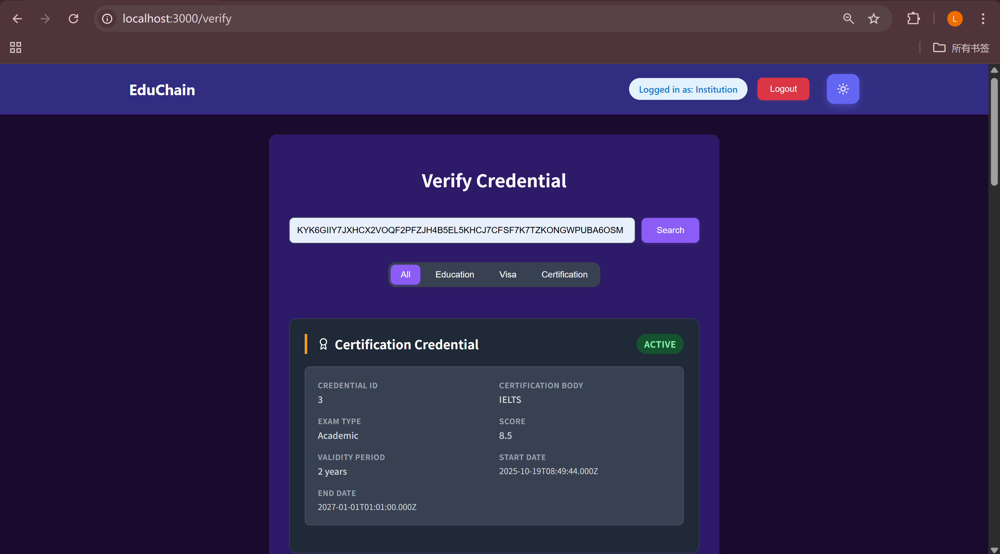
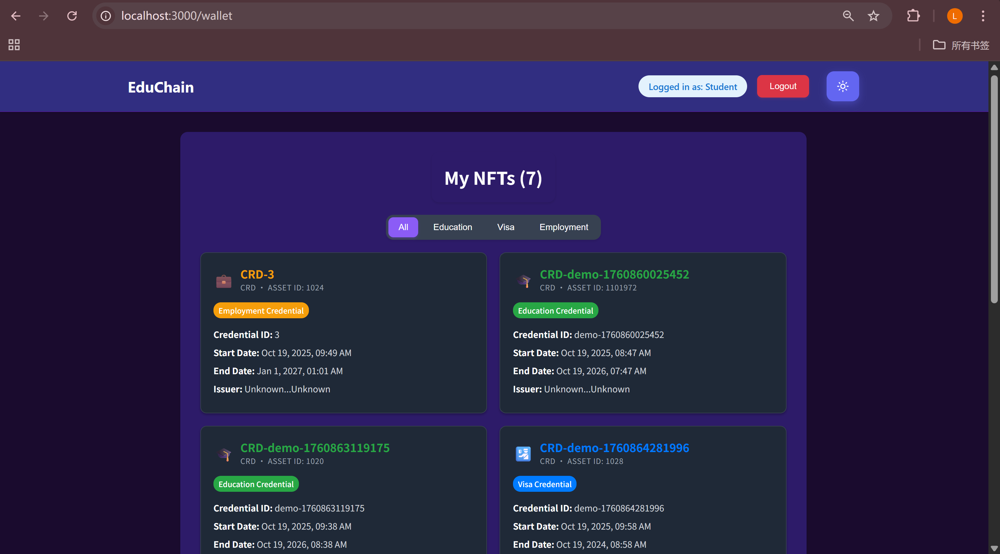

[README.md](https://github.com/user-attachments/files/22989809/README.md)
# EduChain - Blockchain Credential Verification System

EduChain is a comprehensive blockchain-based credential verification platform built on Algorand that enables institutions, authorities, and certifiers to issue tamper-proof credentials with commemorative NFTs. The system supports three credential types (Visa, Education, Certification) and provides real-time verification capabilities.

## 📱 App Demo & Screenshots

### 🎥 Demo Video
**App Demo**: https://youtu.be/aDbYxcGWAPQ  
**Full Structure Demo**: https://youtu.be/WNB6mnbL29k

### 📸 App Screenshots

#### 1. Landing Page

*Main application interface*

#### 2. Landing Page (Light Mode)

*Light theme variant*

#### 3. Login Modal

*User authentication and role selection*

#### 4. Issuer Form

*Credential issuance interface*

#### 5. Verification Page

*Credential verification and search*

#### 6. Student Wallet

*NFT collection display*

## 🏗️ Smart Contract Architecture

### Custom-Built Multi-Credential Registry

#### **Custom Architecture**
The smart contract is a **multi-credential registry built from scratch** using PyTeal that supports:

- **3 Credential Types**: Visa (Schema 1), Education (Schema 2), Certification (Schema 3)
- **Box Storage**: Uses Algorand's Box Storage feature for efficient credential data storage
- **NFT Integration**: Links each credential to a commemorative NFT (ASA)

#### **Data Structure**
Each credential is stored in a **161-byte box** with this exact layout, optimized for credential verification:

```
┌─────────────┬─────────────┬─────────────┬─────────────┬─────────────┬─────────────┬─────────────┬─────────────┬─────────────┐
│ Issuer Addr │ Subject Addr│ Schema Code │ Cred Hash   │ Issued At   │ Expires At  │ Revoked     │ CID Pointer │ NFT ASA ID │
│ (32 bytes)  │ (32 bytes)  │ (8 bytes)   │ (32 bytes)  │ (8 bytes)   │ (8 bytes)   │ (1 byte)    │ (32 bytes)  │ (8 bytes)   │
└─────────────┴─────────────┴─────────────┴─────────────┴─────────────┴─────────────┴─────────────┴─────────────┴─────────────┘
```

#### **Custom Methods**
- **`issue()`** - Issues new credentials with NFT linking
- **`revoke()`** - Revokes credentials by flipping a single byte
- **`get_credential()`** - Read-only credential retrieval
- **`get_nft_asa_id()`** - Retrieves linked NFT information

#### **Custom Security Features**
- **Admin-only operations**: Only the contract creator can issue/revoke
- **Hash validation**: Ensures credential hashes are exactly 32 bytes
- **Schema validation**: Validates schema codes are within valid range (1-3)
- **Address validation**: Ensures subject addresses are properly formatted

#### **Key Custom Innovations**
- **NFT-Credential Linking**: Each credential is tied to a unique NFT ASA ID
- **Efficient Revocation**: Uses `BoxReplace()` to flip a single byte instead of rewriting entire records
- **Multi-Schema Support**: Handles different credential types in one contract
- **IPFS Integration**: Supports CID pointers for off-chain metadata
- **Timestamp Tracking**: Automatically records issuance time

#### **Why It's Custom (Not Boilerplate)**
- **Specific Use Case**: Built specifically for credential verification, not generic
- **Optimized Storage**: Custom 161-byte layout for maximum efficiency
- **NFT Integration**: Unique feature linking credentials to commemorative NFTs
- **Multi-Type Support**: Handles 3 different credential schemas in one contract
- **Box Storage**: Uses Algorand's advanced Box Storage feature (not basic global state)

> **This is a production-ready, custom-built smart contract designed specifically for EduChain's credential verification needs, not a generic template or boilerplate code.**

## 🚀 Quick Start

### Prerequisites
- Node.js 18+
- Python 3.8+
- Docker (for LocalNet)
- AlgoKit CLI

### Installation
```bash
# Clone the repository
git clone <repository-url>
cd Algorand/hackathon1018

# Install smart contract dependencies
cd projects/cred_contracts
pip install -r requirements.txt

# Install frontend dependencies
cd ../web
npm install
```

### Running Locally
```bash
# Start LocalNet
algokit localnet start

# Deploy smart contract
cd projects/cred_contracts
algokit project run deploy_localnet

# Start frontend
cd ../web
npm run dev
```

## 📁 Project Structure

```
hackathon1018/
├── projects/
│   ├── cred_contracts/          # Smart Contract Backend
│   │   ├── src/app.py           # Main PyTeal contract
│   │   ├── src/deploy_localnet.py
│   │   └── artifacts/           # Deployed contract info
│   └── web/                     # Next.js Frontend
│       ├── lib/                 # Core business logic
│       ├── components/          # React components
│       ├── pages/              # Next.js pages
│       └── contexts/           # State management
└── README.md                   # This file
```

## 🔧 Features

- **Multi-Role Support**: Institution, Authority, Certifier, Student roles
- **Real Blockchain Integration**: Actual Algorand transactions, not simulation
- **NFT Minting**: Automatic commemorative NFT creation for each credential
- **Credential Verification**: Real-time verification against blockchain
- **Revocation Support**: Secure credential revocation capabilities
- **LocalNet Development**: Complete development environment with funding

## 🛠️ Technology Stack

- **Blockchain**: Algorand (PyTeal smart contracts)
- **Frontend**: Next.js + TypeScript + React
- **Development**: AlgoKit + LocalNet
- **Storage**: Algorand Box Storage
- **NFTs**: Algorand Standard Assets (ASAs)

## 📄 License

This project is part of the Algorand Hackathon 1018 submission.

---

**Built with ❤️ for the Algorand ecosystem**
